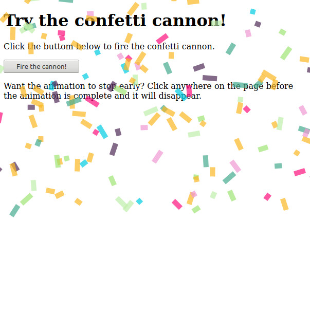

# Canvas-Confetti-Cannon

A simple demonstration of a webpage confetti cannon using a transparent canvas element. Due to the use of ES6 features [Babel](https://babeljs.io/) is recommended for legacy browser support.

